## Basics of OOP

### Pillars of OOP

- Abstraction (Hiding implementation details)
- Polymorphism (Same method multiple behaviour - base class and sub-class overriding)
- Encapsulation (Binds data and methods together, access control via access specifier)
- Inheritance (inherit parent attributes)

### Relations Between Objects

1. **Association** - When one class uses another. Indicated by arrow. Bi-directional association - arrow at both the ends
    Arrow -> or <->
    Link always there
2. **Dependency** - Weaker association. No permanent link. 
    Typically, an object accepts another as method parameter, instantiates, or uses another object
    If changes in one class leads to modifications in another class
    Dotted arrow ( ----> )
3. **Composition** - a "whole-part" relationship between 2 objects, one of which is composed of one or more instances of the other
    Distinction between this and the others - component can only exist as a part of the container.
    Filled Diamond at one end(container), arrow at the other end(component) **D**->
    UML notation can represent quantities on both sides of relationships, but its okay to omit if quantities aren't clear
4. **Aggregation** - a less strict variation of composition, where one object merely contains a reference to another. 
    The container doesn't control the life cycle of the component. The component can exist without the container and can be linked to several containers at the same time.
    Drawn similar to composition, but with empty diamond on the arrow's base 

D/B Composition and Association - 

Association - parent simply uses child. Permanent link (Teacher-student - strong)
Dependency - No permanent link but uses (Car - engine -weak)
Composition - child cannot exist w/o parent. (whole-part/container-component)
Aggregation - child can exist w/o parent (whole-part/container-component)

## What is a design pattern?
Typical solutions to commonly occurring problems in software design

A pattern consists of 
- Intent of the pattern briefly describes the problem and solution
- Motivation further explains the problem and the solution the pattern makes possible
- Structure of classes shows each part of the pattern and how they are related
- Code example - easier to grasp the idea behind the pattern

## Classifications - based on intent / purpose

- **Creational Patterns** - provide object creation mechanisms that increase flexibility and reuse of existing code
- **Structural Patterns** - how to assemble objects nd classes into larger structures, while keeping the structures flexible and efficient 
- **Behavioural patterns** - take care of effective communication and the assignment of responsibilities between objects

## Why should we learn patterns?
Tried and tested solutions

## Software Design Principles

### Features of Good Design
Code re-use
Extensibility
Easy to read/maintain

### Design Principles

_Encapsulate what varies_ - Identify the aspects of your application that vary and separate them from what stays the same

Isolate the parts that vary in independent modules, protecting the rest of the code from adverse effects
Less time spend making changes, more time you have for implementing the features

**_Method level_** :
Example :  getOrderTotal(order) method that calculates total including taxes. Taxes have different rules for different states and they tend to change
Can separate/isolate tax calculation(changes with time) from getOrderTotal(doesn't change)

**_Class level_** : 
Example:

Order
-lineItems
-country
-state
-city
+getOrderTotal()
+getTaxRate(Country, State, Product)

Order D-> TaxCalculator

TaxCalculator
.
.
+getTaxRate(country,state, product)
-getUSTax(state)
-getEUTax(Country)
-getChieneseTax(product)

### **Program to an interface, not an implementation. Depend on abstractions, not on concrete classes**

Design is flexible if you can easily extend it w/o breaking any existing code
Eg: A cat that eats any food is flexible than a cat that eats sausages

When you want two classes collaborate, you can start by making one of them dependent on other.
There is another flexible way to set up collaboration between objects

1. Determine what exactly one object needs from the other. Which method does it execute?
2. Describe these methods in a new interface or abstract class
3. Make the class that is a dependency implement this interface
4. Now make the second class dependent on this interface rather than on the concrete class. You till make it work with objects
   of the originla class, but the connection is much more flexible 

Cat -> Sausage
Cat -> <Food> _implements_ Sausage

Company
-> Programmer
-> Designer
-> Tester

Desinger d = new Designer()
d.designArchitecture()
Programmer p = new Programmer()
p.writeCode()
Tester t = new Tester()
t.testSoftware()

The above implementation is tightly coupled

Company
->Employee

Desinger implements Employee
Programmer implements Employee
Tester implements Employee

employees = [new Designer(), new Programmer(), new Tester()]
foreac(Employee e in employees){
e.doWork();
}

The company class remains coupled to the employee classes. It is bad because if we introduce new types of
companies that work with other types of employees , we will need to over-ride most of the Company classes instead of reusing the code

To solve this, we could declare the method for getting employees as abstract. Each concrete company will implement this method differently, creating only those employees that it needs

abstract Company
GameDev Company extends Company -> Artist, Designer
OutSourcing Company extends Company -> Programmer, Tester
 
Class GameDevCompany{
getEmployees(){
return [new Designer(), new Artist()];
}
}

Class OutSourcingCompany{
getEmployees(){
return [new Programmer(), new Tester()];
}
}

The above is an example of Factory method Design pattern :o

### Favor Composition over Inheritance

Inheritance - the most obvious and easy way of reusing code between classes. 
Two classes with same code? - create a common base class. Simple! - no, it comes with caveats

**List of problems with inheritance**

1. **A subclass can't reduce the interface of the superclass** - 
   You have to implement all abstract methods of the parent class even if you won't be using them
2. **When overriding methods you need to make sure that the new behaviour is compatible with the base one**
   It's most important because objects of the subclass may be passed to any code that expects ob objects of the superclas and you don't want that code to break
3. **Inheritance breaks encapsulation of the superclass** 
    because the internal details of the parent class become available to the subclass. There might be an opposite situation where a pro-grammer makes a superclass aware of some details of sub classes for the sake of making further extension easier 
4. **Subclasses are tightly coupled to superclasses.**
   Any change in superclass may break the functionality of subclasses
5. **Trying to reuse code through inheritance can lead to creating parallel inheritance hierarchies**
    Inheritance usually takes place in a single dimension. But whenever there are two or more dimensions, you have to create a lots of class combinations, bloating the class hierarchy to a ridiculous size

There is an alternative to inheritance called composition
Whereas inheritance represents a 'is a' relationship between classes, composition represents the 'has a ' relationship
Car is a transport. Car has a engine

This principle also applies to aggregation - more relaxed variant of composition. 
A car has a driver

Example:

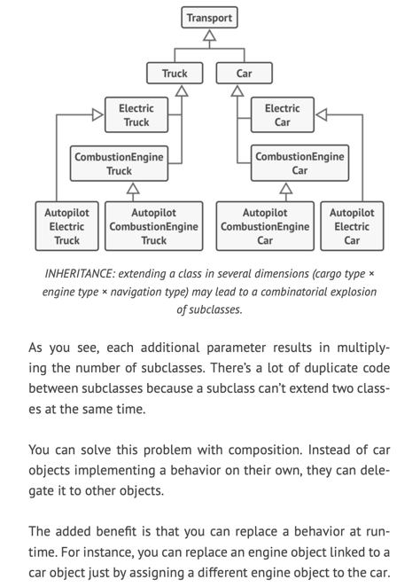
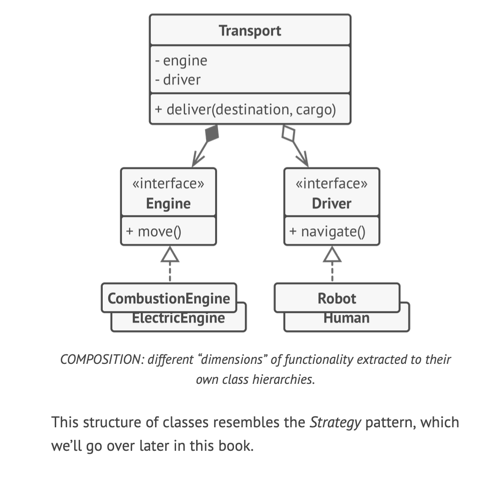

# SOLID PRINCIPLES - robert martin
- to make software designs more understandable, flexible and maintainable
- Using these mindlessly can cause more harm than good
- Doubt that there is a successful software product in which all of these principles are applied at the same time
- Striving for these principles is good, but always try to be pragmatic

## Single Responsibility Principle

- _A class should just have one reason to change_
- _If a class does too many things, we need to change it every time when one of these changes_
- _While doing that, we are risking breaking other parts of the class which we didn't intend to change_

Example:

Employee
- -name
- +printTimeSheetReport()

format of the timesheet may change over time

Make it, TimeSheetReport -> Employee

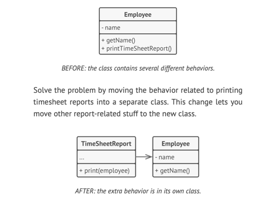

## Open/Closed Principle

Classes should be open for extension but closed for modification

- Keep existing code from breaking when you implement new features
- A class is open if you can extend it - add new methods or fields, override base behaivour etc
- Some programming languages let you restrict further extension of a class with special keywords, - _final_
- After this , the class is no longer open - impossible to inherit or override
- It's interface is clearly defined and won't be changed in future

If a class is already developed, tested, reviewed and included in some framework or otherwise used in an app, trying to mess with it's code is risky
In stead, you can create a subclass and override parts of the original class that you want to behave differently 

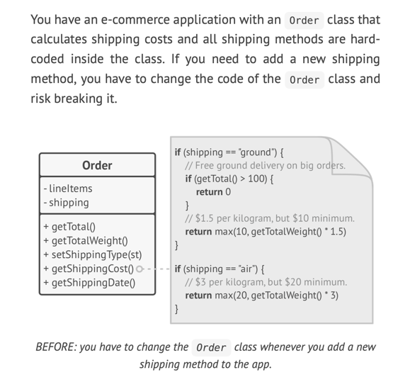
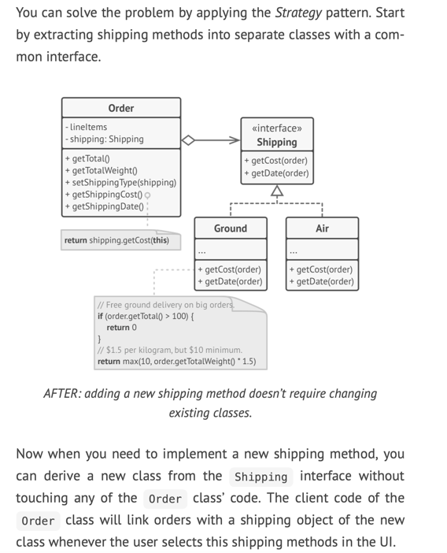

## Liskov Substitution Principle
- When extending to a class, you should be able to pass objects of the subclass in place of objects of the parent class without breaking the client code
- This means that subclass should be compatible with the behavior of the superclass
- When overriding a method, extend the base behavior rather than replacing it with some-thing else entirely
- Unlike other design principles, which are wide open for interpretation, the substitution principle has a set of formal requirements for subclasses
  1. Parameter types in a method of a subclass should match or be more abstract than parameter types of the methods of the super class
     Example: 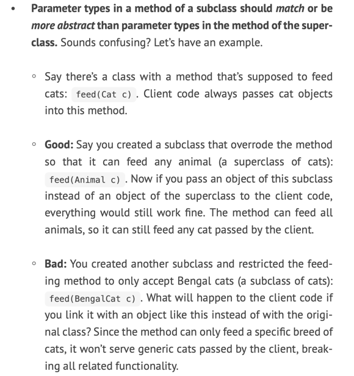
  2. The return type in a method of a subclass should match or be a subtype of the return type in the method of the superclass
     Example: 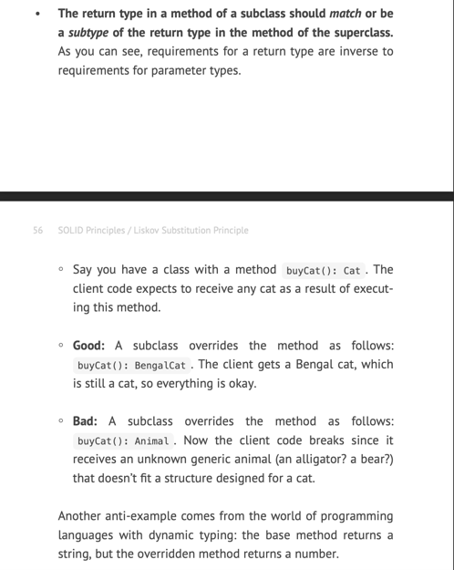
  3. A method in a subclass shouldn't throw types of exceptions which the base method isn't expected to throw
     Example: 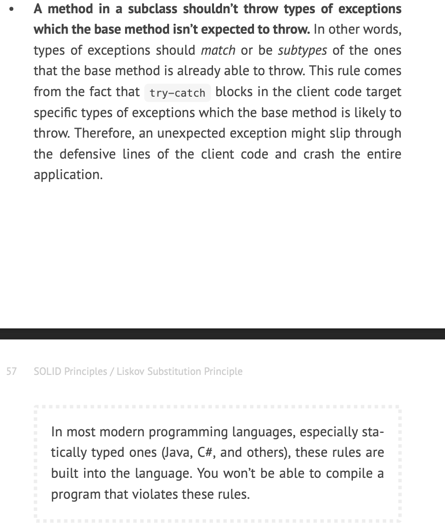

    In most modern programming languages, especially statically typed ones (java, C# and others) these rules are built into language. You won't be able to compile a program that violates these rules

  4. A subclass shouldn't strengthen pre-conditions
     Example: 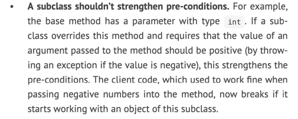
  5. A subclass shouldn't weaken post-conditions
     Example: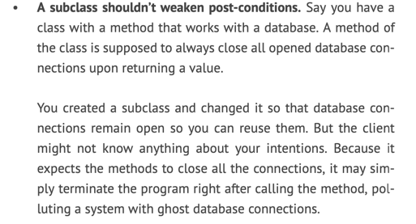
  6. Invariants of a superclass must be preserved (least formal rule of all)
     Example: 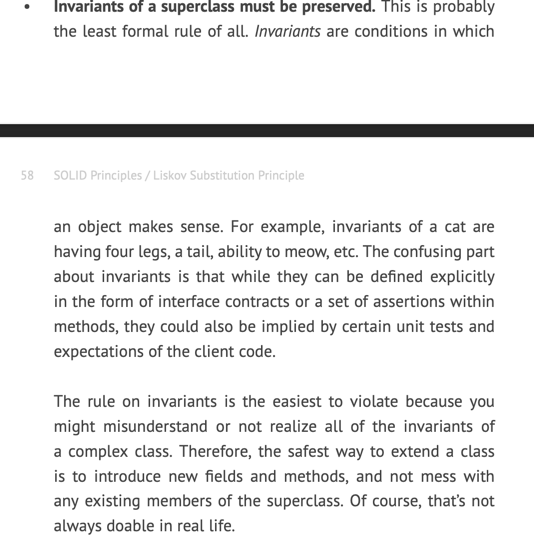
  7. A subclass shouldn't change values of private fields of the superclass
     Example: 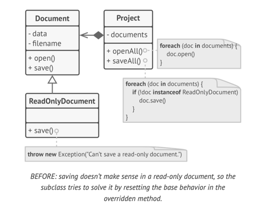
     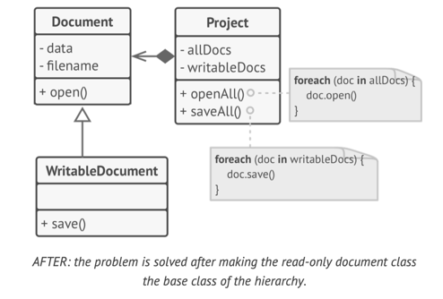
  

## Interface segregation principle

- Clients shouldn't be forced to depend on methods they do not use
- You should break down fat interfaces into more granular and specific ones
- Clients should only implement those methods that they really need. Otherwise, a change to the fat interface would break even clients that don't use the changed methods
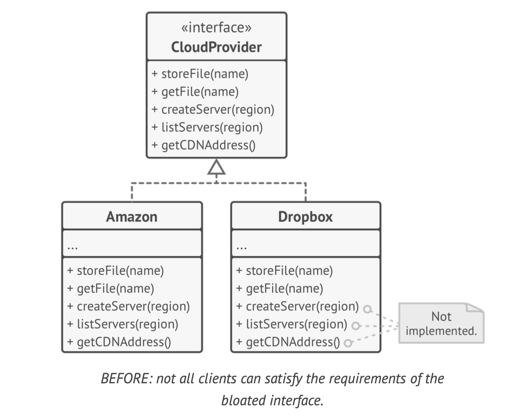
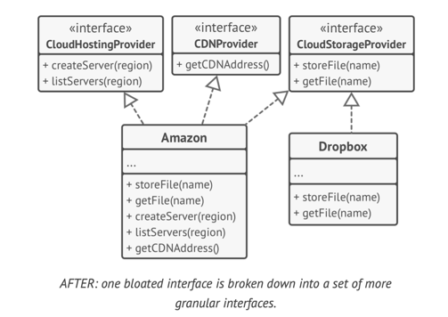

## Dependency Inversion Principle

- High level classes shouldn't depend on low-level classes. Both should depend on abstractions.
- Abstractions shouldn't depend on details. Details should depend on abstractions

+ Low level classes - implement basic operations such as working with a disk, transferring data over a network, connecting to a database etc
+ High level classes contain complex business logic that directs low-level classes to do something

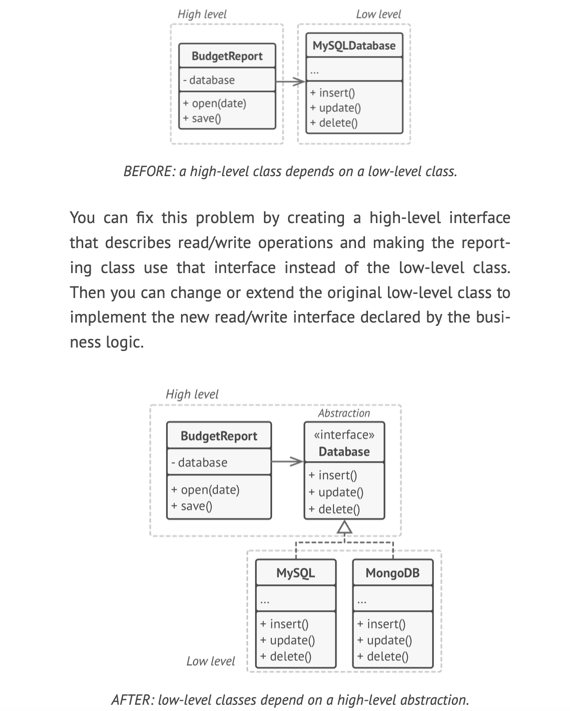

# Dive Into Design Patterns

# DesignPatterns

In Software Design, there are problems that everyone faces and find solutions to it over time. But since these as said are common, we don't want to re-invent the wheel. Common language oriented design patterns are classified as Creational, Structural and Behavioural patterns.

**Creational Design Patterns:**

Different ways to create objects - where and why we should a particular design pattern

1. **Singleton Pattern**: 
    Ensures a class has only one instance and provides a global point of access to it.

    Applications:
    > Logging
    > DB connection
    > Configuration
    > Thread Pool manager
    > Caching

    How to Implement?

   - Eager initialization (during start of app)
   - Static block initialization (similar to Eager, but have a static block - to do additional operations)
   - Lazy initialization (When required, not early)
   - Thread Safe initialization (Multithreading)
   - Bill Pugh initialization (Solves few memory problems - in legacy code/ older java version)

2. **Factory Method Pattern**: 
    Defines an interface for creating objects but allows subclasses to alter the type of objects that will be created.

    > Design/Creation logic is hidden from the client
    > Many subclass types, only one instance required
    > Creation is removed from the client
    > Useful for frequent code changes

    Eg: Database - can be PSQL, MySQL, Oracle, Thirdparty n/w service

    Interface or abstract class that defines common functionality 
    Interface implementations
    Factory class that instantiates the right implementation

3. **Abstract Factory Pattern**: 
    Provides an interface for creating families of related or dependent objects without specifying their concrete classes.
    > One level of abstraction above factory method
    > Provides a way to access functionality without caring about implementation
    > Separation of concerns
    > Allows for testability

    E.g: Say we have a display that can get data from multiple data sources - database, user input, network, file storage, 3p app

    We can have Datasource as an interface, implemented by Database and Network
    We can have a datasource factory as an interface, implemented by DataBaseFactory, NetworkFactory

4. **Builder Pattern**: 
    Separates the construction of a complex object from its representation, allowing the same construction process to create different representations.

    > Used when we have multiple parameters to initialize 
    > For many parameters, it's impractical to build all constructors
        > 5 paramenter combinations - 120 constructors
    > Especially when we have many optional parameters
    > Should be easy to read

5. **Prototype Pattern**:   
    Creates new objects by copying an existing object, known as the prototype.

    > Lets you copy existing objects
    > Without depending on their classes
    > Only reliant on interface - Clonable
    > The copied object must provide the copy functionality
    > Useful in testing and pre-production - 

**Structural Design Patterns:**

How you structure components in an application and how they interact

6. **Adapter Pattern**: 
    Allows the interface of an existing class to be used as another interface.

    > Converts the interface of a class into another interface the client expects
    > Convert data from one format to another
    > Used in API wrappers - legacy code integration, multiple DBMS/CSP connectors
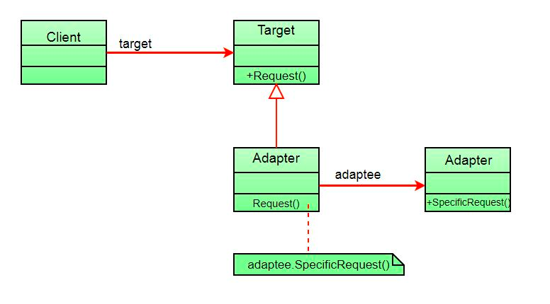

7. **Decorator Pattern**: 
    Adds new responsibilities to objects dynamically without altering their structure.
    
    > Decorator/Wrapper pattern
    > Attach new behaviour to an object
    > Without altering existing code
    > Overriding behaviour

    E.g: Consider a n/w communication system - tcp protocol that contains sendPacket func
         Say we want to create a new protocol on top of it NetworkComm that contains SendNetworkMsg()
         And ApiService that has send / retrieveAPI on top of it
        

8. **Composite Pattern**: 
    Composes objects into tree structures to represent part-whole hierarchies.
    
    > Composite objects into tree structures
    > Works when the core functionality can be represented as a tree 
    > Can manipulate many objects as a single one 
    > Eg: Computer is made of memory, CPU, HDD
    > Memory has RAM, ROM

9. **Proxy Pattern**: 
    Provides a surrogate or placeholder for another object to control access to it.
   
    > Provide some functionality before and/or  after calling an object
    > Same interface as the original object
    > Similar to facade, except the proxy has the same interface
    > Similar to decorator, except that the proxy messages the lifecycle of it's object 
    > Say we have a disk and multiple clients trying to access it
    > we don't want them to access disk every time
    > we will introduce a DiskProxy(cache) in between

10. **Bridge Pattern**:
    Separates an object's abstraction from its implementation, allowing both to vary independently.
    
    > having classes with multiple orthogonal traits exponentially increases the size of the inheritance tree
    > Convert from inheritance to composition
    > We split them into multiple interfaces
    > Associate them using a "bridge" reference

11. **Facade Pattern** 
    Provides asimple interface to a complex functionality
    
    > Removes the need for complex memory/object management
    > Simplifies client implementation

**Behavioral Design Patterns:**

How objects behave/communicate

12. **Observer Pattern**: 
    Defines a one-to-many dependency between objects, so that when one object changes state, all its dependents are notified and updated automatically.
    
    > Define a subscription mechanism
    > Notify multiple objects simultaneously
    > Event manager that notify subscribers once event is available
    > We can have multiple events and multiple subscribers
    > E.g : Say we have some time intensive processing
    > We have a component that uses our app
    > This component either can poll periodically or wait for notification
    > Poll - lot of communication back and forth
    > What if there are multiple such clients
    > Huge load
    > We can have a registry in between
    > The registry can notify the clients once results are ready
    > The registry can handle multiple events and multiple results

13. **Strategy Pattern**: Defines a family of algorithms, encapsulates each one, and makes them interchangeable.
14. **Command Pattern**: 
    Encapsulates a request as an object, thereby allowing for parameterization of clients with queues, requests, and operations.
    
    > A request is wrappeed in an object that contains all the request info
    > The command object is passed to the correct handler
    > Decoupling
    > Process commands with Efficient, ordering, priority etc based on Commands
    > Let's say we have a GUI with lot of buttons, checkbox  , fields etc
    > And we have business logic in the backend that needs to triggered with some ops in GUI

15. **State Pattern**: Allows an object to alter its behavior when its internal state changes.
16. **Chain of Responsibility Pattern**: 
    Passes a request along a chain of handlers. Upon receiving a request, each handler decides either to process the request or to pass it to the next handler in the chain.
    > Define a chain of handlers to process a request
    > Each handler contains a reference to the next handler
    > Each handler decides to process the request AND/OR pass it on
    > Requests can be of different types

**Architectural Design Patterns:**

16. **Model-View-Controller (MVC)**: Separates an application into three interconnected components: Model (data), View (presentation), and Controller (user interface logic).
17. **Dependency Injection**: Inversion of Control (IoC) pattern that deals with how components get hold of their dependencies.
18. **Service Locator**: Centralizes the construction and sharing of services in an application.
19. **Repository Pattern**: Separates the logic that retrieves data from a data store (e.g., a database) from the business logic.

**Concurrency Design Patterns:**

20. **Thread Pool**: Manages a pool of worker threads to execute tasks asynchronously.
21. **Producer-Consumer**: Coordinates the actions of multiple threads to process data in a producer-consumer scenario.
22. **Readers-Writers**: Manages multiple readers and writers accessing a shared resource, ensuring data integrity.
23. **Semaphore**: Controls access to a resource by limiting the number of threads that can access it simultaneously.

